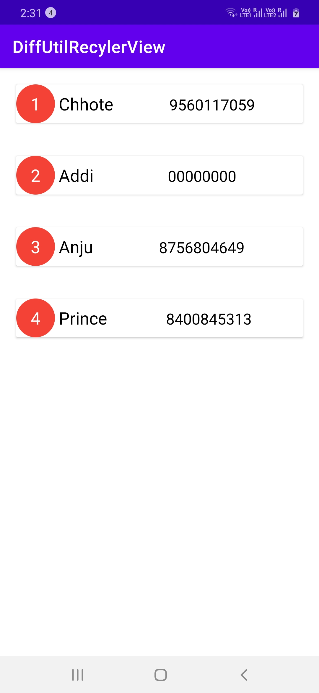
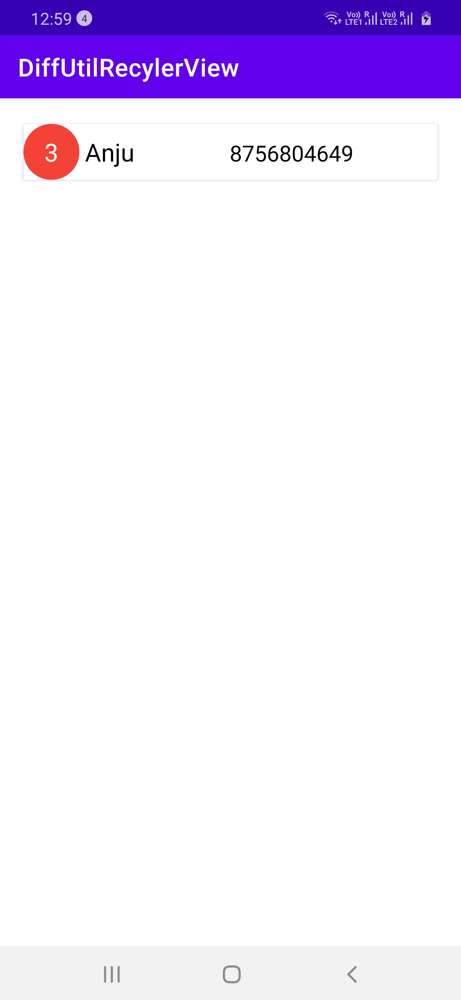
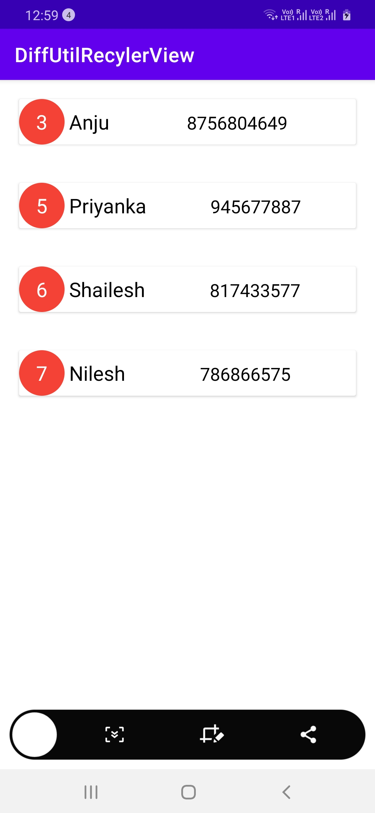

# RecylerViewSamples
RecyclerView with DiffUtil is a way to improve the performance of your app. List Adapter implements diffUtil for you and runs the diffutil algorithm on the background thread. DiffUtil compares two lists on the background thread and provides the differences between the two lists. List Adapter class inherits RecyclerView.Adapter class and includes diffutil implementation.   RecyclerView Performance can be optimized using DiffUtil and List Adapter. Use submitlist method to provide the new list to your recycler view and it will only update the items that are changed, the rest of the items remain the same. 
 

